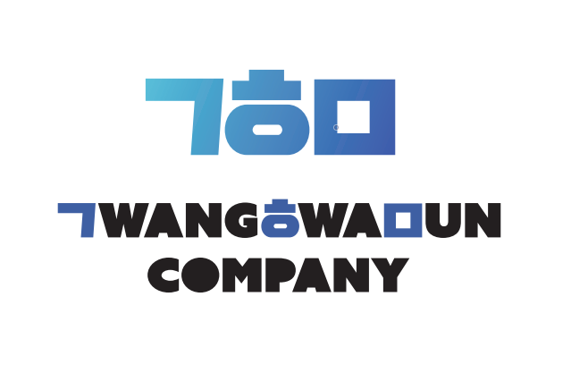

 

## About Me
안녕하세요, 저는 saint-hong 입니다. 데이터 분석과 딥러닝 모델링에 깊은 지식을 가진 데이터 사이언티스트가 되기 위해 노력하고 있습니다. Jupyter Notebook 개발환경과 TensorFlow 프레임워크에서 Python 언어를 사용하여 데이터 분석을 하고 있습니다. 비즈니스 성과를 위한 1bite라도 더 과학적인 데이터 사이언스 방법론을 지향합니다. 

## Interest these days
- 딥러닝 SOTA : NeuralNet, CNN, VGG, Yolo, Resnet, DensNet, MobileNetV2, HRNet, CoAtNet, VIT, ConvNeXt
- 자연어 분석 : RNN, LSTM, Highway Networks, NLG, Seq2seq, Bert
- 컴퓨터 비전 : SSL, XAI, MOCO, BYOL
  
## TMI
기술의 발달은 터프한 상태에서 섬세한 상태로 진보하며 이 과정은 기술이라는 날실과 예술이라는 씨실로 직조된다고 생각합니다. 니콜라스 니그로폰테의 미디어 이론과 마르셀 뒤샴의 예술이론을 좋아합니다. 새로운 아이디어가 번뜩이는 편이고, 다양한 분야의 담론이나 건설적인 이야기를 좋아합니다.
